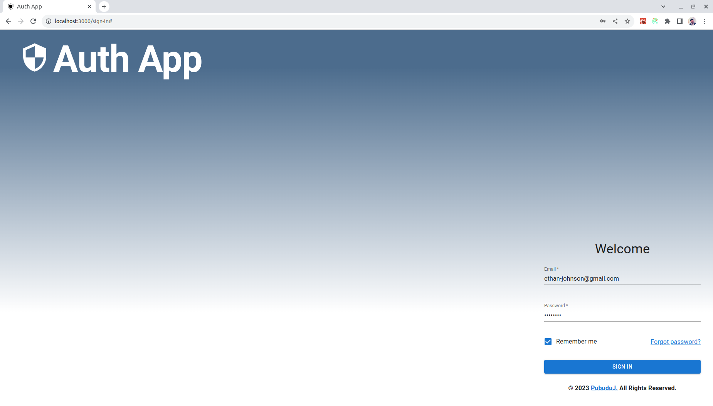
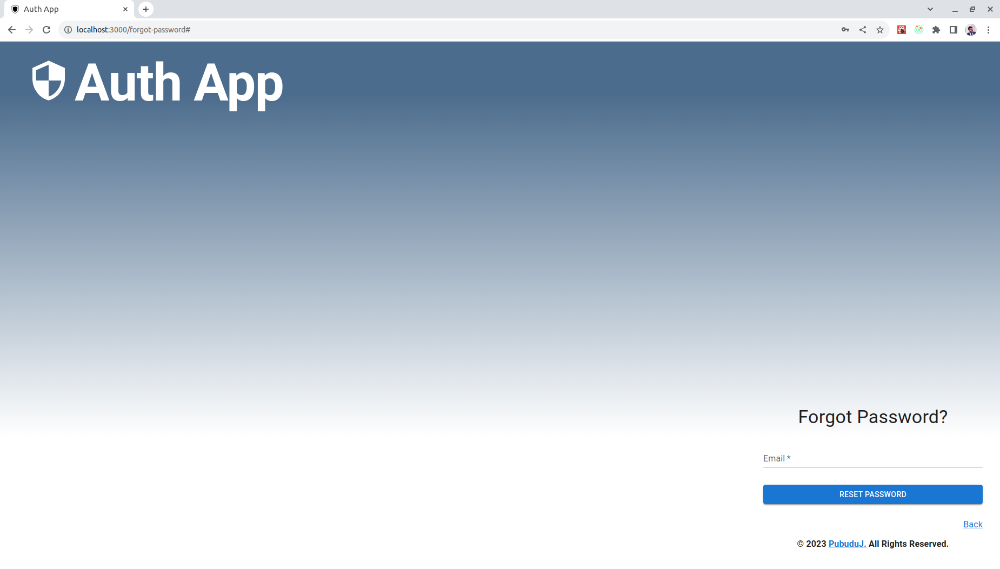
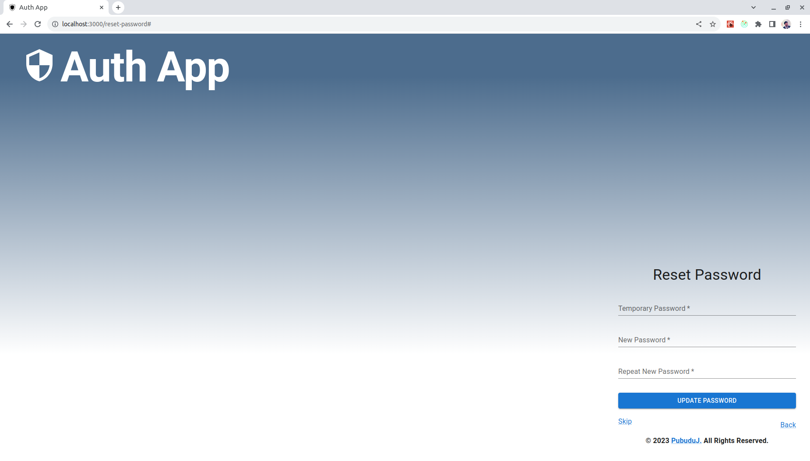
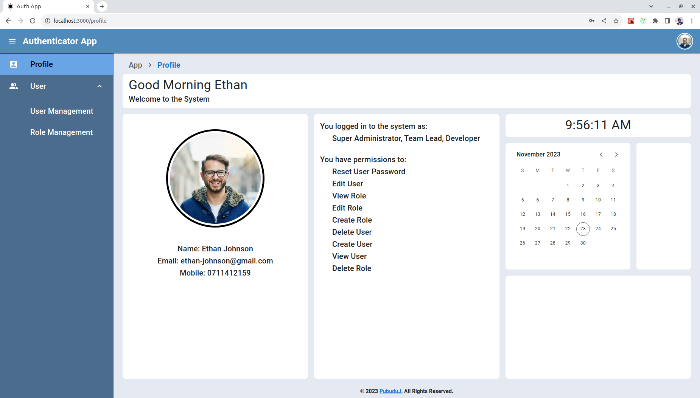
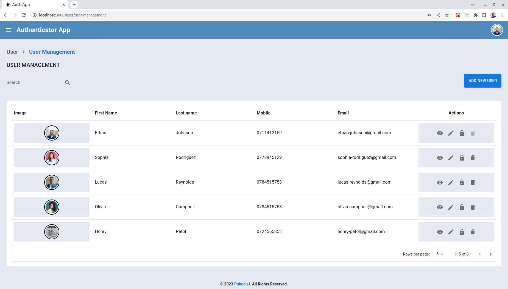
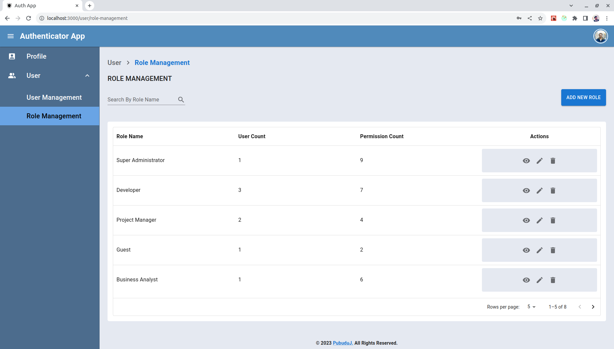

# Use Authenticator Application Front End 

This is a **mobile-responsive web-based user authentication system.** 
Upon registration, users gain access to the system where their **assigned roles and permissions** dictate the functionalities available to them. 
For instance, a guest user is restricted from performing operations within the system and is limited to viewing details exclusively.

#### Key features of the system include,

- The Super Administrator, serving as the system's primary authority, possesses comprehensive access across all functionalities within the system.

- Registered users have the capability to assume multiple roles, each of which may entail various permissions within the system. Upon logging in, a user can view their assigned roles and associated permissions within the Profile section.

- The system accommodates an unlimited number of users and roles, ensuring scalability and adaptability to organizational needs.

- Users hold exclusive authority over changing their own passwords. However, the Super Administrator retains the ability to reset a user's password, triggering the issuance of a temporary password sent via email. The user can then employ this temporary password to reset their password securely.

**Back End** of the project can be visited by clicking [**here.**](https://github.com/PubuduJ/user-authenticator-app-back-end) 
The **low-level design** of the project's **dashboard** can be visited by clicking [**here.**](https://github.com/PubuduJ/responsive-dashboard-design-layout) 
Click [**here**](https://github.com/PubuduJ/image-uploader) to view a sample project of **user profile image uploader.**

#### User Interfaces

- Sign In Page 

- Forgot Password Page 

- Reset Password Page 

- Profile Page 

- User Management Page 

- Role Management Page 

#### Desktop View Demo Video

https://github.com/PubuduJ/user-authenticator-app-front-end/assets/109058596/0135e593-63ba-4cb6-a875-ffb0e4efcb7f

#### Mobile View Demo Video

https://github.com/PubuduJ/user-authenticator-app-front-end/assets/109058596/60bcc4ab-93bd-4e08-800c-bfb337db9b05

## Used Technologies

- React
- MUI
- Ant Design
- Redux Toolkit
- Axios
- TypeScript
- CSS
- HTML
- JWT

#### Used Integrated Development Environment
- IntelliJ IDEA

## How to use ?
- This project can be used by cloning the project to your local computer.
- Clone the project using `https://github.com/PubuduJ/user-authenticator-app-front-end` terminal command.
- Run `npm install` and `npm start` to run the project.

## Version
v1.0.0

## License
Copyright &copy; 2023 [Pubudu Janith](https://www.linkedin.com/in/pubudujanith/). All Rights Reserved. 
This project is licensed under the [MIT license](LICENSE.txt).
