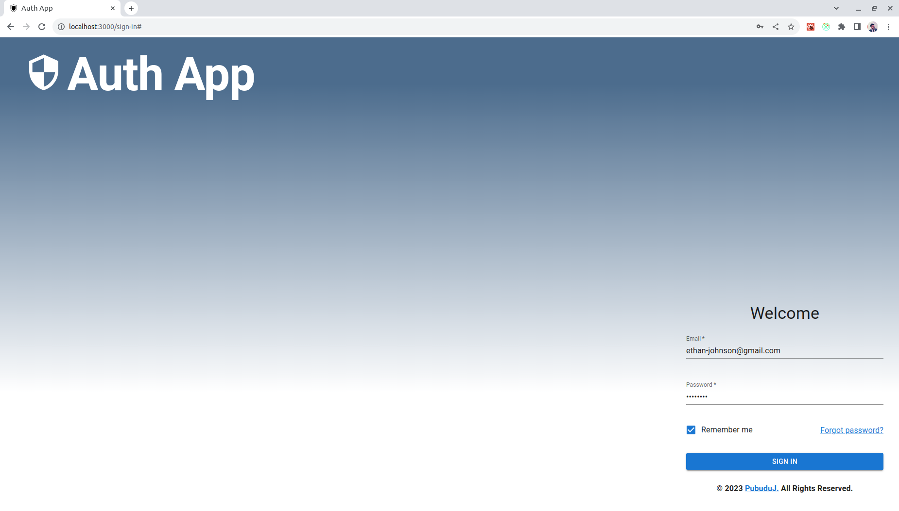
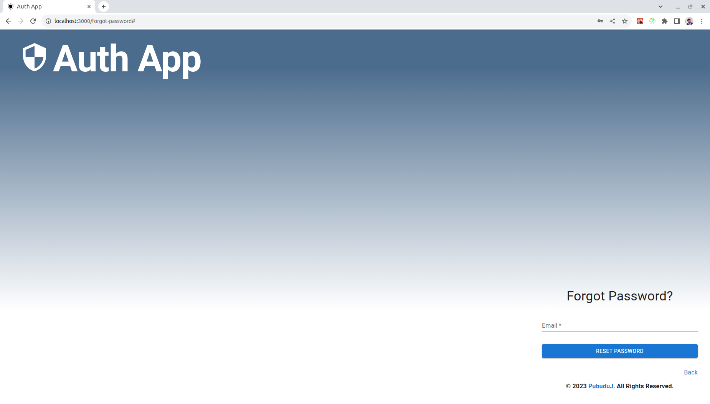
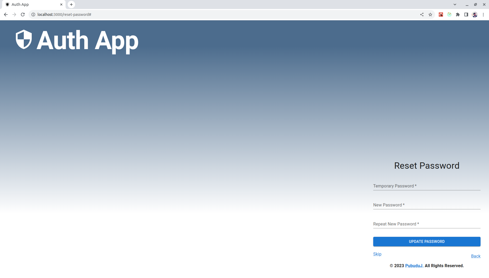
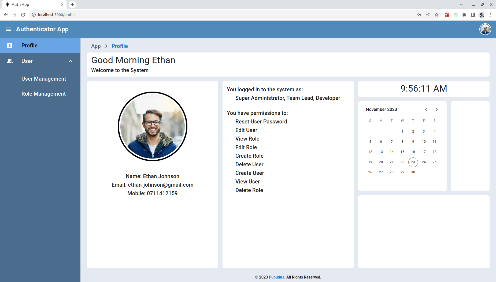
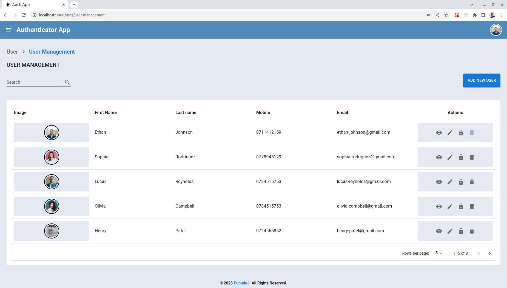
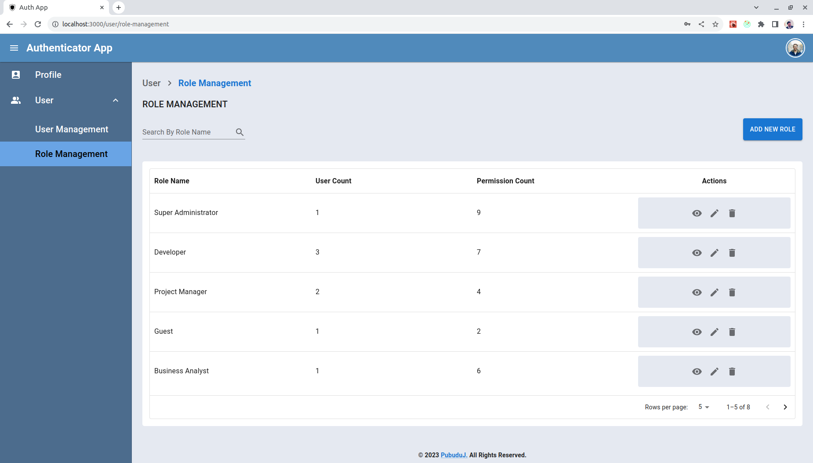

# Use Authenticator Application 

#### User Interfaces

- Sign In Page 

- Forgot Password Page 

- Reset Password Page 

- Profile Page 

- User Management Page 

- Role Management Page 

## Used Technologies

- React
- MUI
- Ant Design
- Redux Toolkit
- Axios
- TypeScript
- CSS
- JWT

#### Used Integrated Development Environment
- IntelliJ IDEA

## How to use ?
- This project can be used by cloning the project to your local computer.
- Clone the project using `https://github.com/PubuduJ/responsive-dashboard-design-layout.git` terminal command.
- Run `npm install` and `npm start` to run the project.

## Version
v1.0.0

## License
Copyright &copy; 2023 [Pubudu Janith](https://www.linkedin.com/in/pubudujanith/). All Rights Reserved. 
This project is licensed under the [MIT license](LICENSE.txt).
